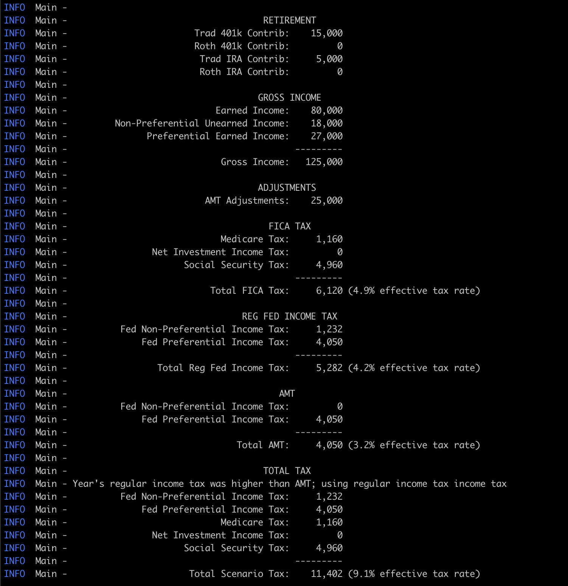

Wealthdraft
===========
A tax calculator for predicting your taxes. Handles:

* Regular federal income tax, AMT, and choosing the higher of the two
* Employment tax (Social Security & Medicare)
* Net Investment Income Tax
* 401k, IRA, and standard deductions, and applying them in the right order
* Foreign-earned income exclusion

Usage
-----
### Quickstart
1. Download the latest version of the binary from [the releases page](https://github.com/mieubrisse/wealthdraft/releases)
2. Copy the `gov-constants-example` and `scenarios-example` files to your machine
3. Modify them as you please
4. Run `java -jar wealthdraft-X.Y.Z.jar --help` to view which flags to pass in

### Development
For easy development, the CLI can be run with the `scripts/build_and_run.sh` script, where any arguments to the script are passed to the CLI. With no arguments, the scenario in `scenarios-example.yml` will be run with the gov constants defined in `gov-constants-example.yml`. To use your own scenarios or gov constants, run `build_and_run.sh --help` to see the flags you'll need for running your own files.

### Building a binary
`./gradlew jar` will create a standalone JAR in the `build/libs` directory that can be transferred and used on other machines. This fat JAR can be executed with `java -jar wealthdraft.jar --help` to see usage information.

